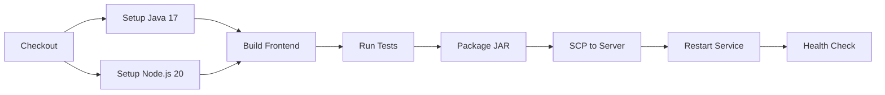

# CI/CD 部署指南

## 概述

使用 GitHub Actions 实现自动构建和部署。当推送代码到 `main` 分支时，自动执行：

1. 构建前端（Vue 3 → 静态文件）
2. 运行后端测试
3. 打包 Spring Boot JAR
4. 上传到服务器
5. 重启服务

## Workflow 文件

`.github/workflows/deploy.yml`

## 触发条件

- 推送 `main` 分支
- 手动触发（GitHub 页面点击 `Run workflow`）

## 前置条件

### GitHub Secrets 配置

在仓库 Settings → Secrets and variables → Actions 中添加：

| Secret | 说明 | 示例 |
|--------|------|------|
| `SSH_HOST` | 服务器 IP 地址 | `123.456.789.0` |
| `SSH_USER` | SSH 登录用户名 | `root` |
| `SSH_PASSWORD` | SSH 登录密码 | — |
| `SSH_PORT` | SSH 端口 | `22` |
| `APP_DIR` | 服务端部署目录 | `/opt/fundval` |

### 服务器环境要求

| 工具 | 用途 | 验证命令 |
|------|------|---------|
| Java 17+ | 运行 JAR | `java -version` |
| curl | 健康检查 | `curl --version` |

## 构建流程



### 1. 构建前端

```bash
cd frontend
npm install
npm run build
```

构建产物输出到 `src/main/resources/static/admin/`，被打包进 JAR。

### 2. 运行测试

```bash
./mvnw test
```

包含 14 个测试：预估计算逻辑（8）+ API 端点（5）+ 上下文加载（1）。

### 3. 打包

```bash
./mvnw -DskipTests package
```

生成 `target/FundValuation-0.0.1-SNAPSHOT.jar`。

## 部署流程

### 文件传输

通过 SCP 将 JAR 上传到服务器的 `APP_DIR` 目录：

```bash
# appleboy/scp-action 内部执行
scp target/FundValuation-0.0.1-SNAPSHOT.jar user@host:/opt/fundval/
```

### 服务重启

服务器上执行以下脚本：

```bash
set -e
APP_DIR="/opt/fundval"
JAR_FILE="$APP_DIR/FundValuation-0.0.1-SNAPSHOT.jar"
PID_FILE="$APP_DIR/fundval.pid"
LOG_FILE="$APP_DIR/app.log"

# 停止旧进程
if [ -f "$PID_FILE" ]; then
  OLD_PID="$(cat "$PID_FILE")"
  if [ -n "$OLD_PID" ] && kill -0 "$OLD_PID" 2>/dev/null; then
    kill "$OLD_PID" || true
    sleep 3
  fi
fi

# 启动新进程
nohup java -jar "$JAR_FILE" \
  --spring.profiles.active=prod \
  --server.port=5000 \
  > "$LOG_FILE" 2>&1 &
echo $! > "$PID_FILE"

# 健康检查
sleep 8
curl -fsS http://127.0.0.1:5000/api/funds > /dev/null
```

## 手动部署

如需手动部署，可按以下步骤操作：

```bash
# 1. 构建前端
cd frontend
npm install && npm run build
cd ..

# 2. 打包
./mvnw -DskipTests package

# 3. 上传到服务器
scp target/FundValuation-0.0.1-SNAPSHOT.jar user@host:/opt/fundval/

# 4. SSH 登录服务器重启
ssh user@host
cd /opt/fundval
kill $(cat fundval.pid) 2>/dev/null; sleep 3
nohup java -jar FundValuation-0.0.1-SNAPSHOT.jar \
  --spring.profiles.active=prod \
  --server.port=5000 \
  > app.log 2>&1 &
echo $! > fundval.pid
sleep 8
curl http://127.0.0.1:5000/api/funds
```

## 验证

部署成功后访问：

| 地址 | 说明 |
|------|------|
| `http://<host>:5000/api/funds` | API 接口 |
| `http://<host>:5000/admin` | 管理后台（Vue 3） |

## 回滚

如果新版部署失败，用上一次的 JAR 重新启动即可：

```bash
cd /opt/fundval
# 备份在 app.jar.bak 或其他位置
cp FundValuation-0.0.1-SNAPSHOT.jar.bak FundValuation-0.0.1-SNAPSHOT.jar
kill $(cat fundval.pid)
# 等待进程完全退出
sleep 3
# 重新启动
nohup java -jar FundValuation-0.0.1-SNAPSHOT.jar \
  --spring.profiles.active=prod \
  --server.port=5000 \
  > app.log 2>&1 &
echo $! > fundval.pid
```